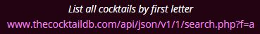

### What do we want to accomplish?

Using the free JSON API made available by the online [Cocktail Database](https://www.thecocktaildb.com/):

1. The user should be able to enter the first letter of a cocktail.
2. The code should make the necessary request to the API and await the response.
3. For each drink, extract the **name**, **instructions** and **required ingredients**.

The [website documentation](https://www.thecocktaildb.com/api.php) suggests that we can use the following request:



We need only change the last letter submitted as part of the request.

<br/>

#### Part 1 - Get user input

Within R, we can use the `readline` function:

```{r eval=FALSE}
user_input <- readline("Please enter a single letter from A-Z: ")
```

<br/>

#### Part 2 - Submit request to API

Now that the user has selected the letter of interest, we can make the request to the API.

Supposing the user had entered `A`, we would send our request to the following target URL:  `https://www.thecocktaildb.com/api/json/v1/1/search.php?f=A`

We can generate the required URL above with the following:

```{r message=FALSE, warning=FALSE, include=FALSE}
library (dplyr)
library (glue)
library (jsonlite)
library (magrittr)
library (stringr)
library (tidyr)
user_input <- 'A'
```

```{r}
# Generate the target URL.
target_url <- glue("https://www.thecocktaildb.com/api/json/v1/1/search.php?f={user_input}")

print(target_url)
```

<br/>Since we are expecting a response in JSON format, we can make the request **and** parse the response using the `fromJSON` function supplied by the `jsonlite` package.

When this function parses the response, it will convert the underlying data into formats that are natively supported by R.

```{r}
# Make the request to the target URL and parse the response.
json_response <- fromJSON(target_url)
```

<br/>

#### Part 3 - Extract drinks info

Let's look to see what the response has been converted into:

```{r}
# Look to see what the response has been converted into.
class(json_response)
```

In R, a list can be used as a collection of key-value pairs.

At this stage, we still don't know exactly how the response has been laid out. Below shows how we can look to see what it is we are working with.

We can check to see what keys are contained within `json_response` using:

```{r}
names(json_response)
```

<br/>We can see that it consists a single key named `drinks`.

We can drill a little deeper using the `$` operator which allows us to extract the value corresponding to a given key in a list.

Let's see the type of value referred to by the `drinks` key:

```{r}
class(json_response$drinks)
```

<br/>Now we're getting somewhere! We can see that the key refers to a `data.frame` which is a convenient way to store tabular information.

We can get the size of this table using:

```{r}
dim(json_response$drinks)
```

<br/>That is, it has `r dim(json_response$drinks)[1L]` rows and `r dim(json_response$drinks)[2L]` columns.

A list of column names is shown below:

```{r}
names(json_response$drinks)
```

<br/>We see that not only do we have a lot more columns than we need in order data, but also that all column names are prefixed with `str`.

Before we select what columns to retain, we should (ideally) remove this prefix from all column names.

The following code snippet both removes the prefixes and ensures that only columns of interest are retained.

This is done using the `rename_all` and `select` functions supplied by the `dplyr` package and the `str_remove` function supplied as part of the `stringr` package.

Note that we are using the same pipe (`%>%`) operator that featured in the Pokemon analysis as this allows us to easily set up a pipeline to transform data.

The resulting subset of the data will be saved into a variable called `drinks_info`.

```{r}
drinks_info <-
  # Take the table originally provided by the JSON response.
  json_response$drinks %>%
  # Remove the 'str' prefix from all column names.
  rename_all(
    str_remove,
    pattern = 'str'
  ) %>%
  # Retain only those columns that we are interested in.
  select(
    Drink,
    Instructions,
    starts_with('Ingredient')
  )
```

<br/>The content of our `drinks_info` table is shown below.

Note that the `str` prefix has been removed from the column headers.

```{r echo=FALSE}
DT::datatable(
  drinks_info,
  editable = FALSE,
  options =
    list(
      scrollX = TRUE
    )
  )
```

<br/>We can see that there are a lot of empty ingredients columns. Although not shown above, these are represented by NA values in the underlying R data.

Using the `unite` function from the `tidyr` package, we can collapse each of these into a single `Ingredients` column where the combined values are comma separated.

```{r}
drinks_info <-
  # Take the original table of information which has separate ingredients columns.
  drinks_info %>%
  # Collapse all the ingredients columns into a single one called 'Ingredients'.
  unite(
    # This is the name of the new column that everything will be concatenated into.
    Ingredients,
    # The source columns.
    starts_with('Ingredient'),
    sep = ', ',
    # Ignore any empty columns containing NA values.
    na.rm = TRUE
  )
```

<br/>Looking at the revised data within `drinks_info`:

```{r echo=FALSE}
DT::datatable(
  drinks_info,
  editable = FALSE,
  options =
    list(
      autoWidth = TRUE,
      columnDefs  =
        list(
          list(width = '40%', targets = 2)
        )
    )
  )
```


#### Finalised code

```{r eval=FALSE}
# Load up any packages that we need.
library (dplyr)
library (glue)
library (jsonlite)
library (magrittr)
library (stringr)
library (tidyr)

# Ask the user!
user_input <- readline("Please enter a single letter from A-Z: ")

# Generate the target URL.
target_url <-
  glue("https://www.thecocktaildb.com/api/json/v1/1/search.php?f={user_input}")

# Make the request to the target URL and parse the response.
json_response <- fromJSON(target_url)

drinks_info <-
  # Take the table originally provided by the JSON response.
  json_response$drinks %>%
  # Remove the 'str' prefix from all column names.
  rename_all(
    str_remove,
    pattern = 'str'
  ) %>%
  # Retain only those columns that we are interested in.
  select(
    Drink,
    Instructions,
    starts_with('Ingredient')
  ) %>%
  # Collapse all the ingredients columns into a single one called 'Ingredients'.
  unite(
    # This is the name of the new column that everything will be concatenated into.
    Ingredients,
    # The source columns.
    starts_with('Ingredient'),
    sep = ', ',
    # Ignore any empty columns containing NA values.
    na.rm = TRUE
  )
```

<br/>

### Final thoughts

Using the `jsonlite` package along with a smattering of others, we've created a script that will accept user input, make the necessary request, process the response and store it in a tabular format than can be further worked as necessary.

I believe that this highlights just how easy it is to work with these alternate formats using readily available packages provided by the wider R eco-system.

The techniques shown here could easily be extended to other services available as part of the JSON API for this cocktail website.