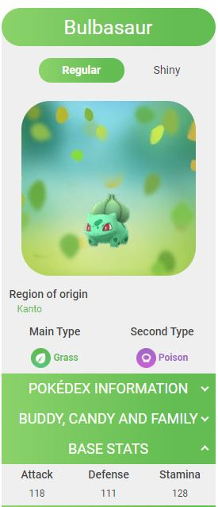
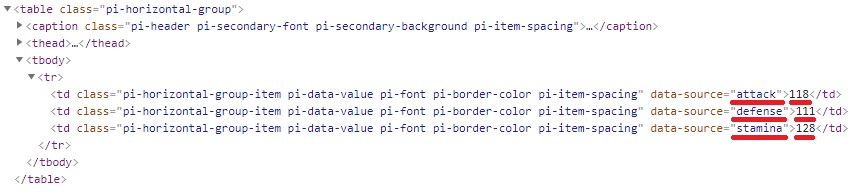

```{r message=FALSE, warning=FALSE, include=FALSE}
library (dplyr)
library (glue)
library (magrittr)
library (selectr)
library (xml2)

pokemon_data <-
  readRDS("POKEMON_DATA.RDS")
```

### Part 2 - Extract basic stats for each Pokémon

<br/>Here we continue from where part 1 left off.

To recap, in part 1 we extracted a list of all Pokémon along with the Wiki-page location for each one into a variable named `pokemon_data`.

Given this information, we can now look to extract the corresponding basis stats for each one.

Below is a reminder of the details we have so far for the first few Pokémon:

```{r}
head(pokemon_data, 5)
```

<br/>Visiting the top Wiki-page in the `LOCATION` column above, we can see the following side-bar.

At the bottom of which we can see that stats we're after.



<br/>Using the same technique as shown in the slides, we can _inspect_ the numbers (using the browser) to see where they are located in the underlying HTML.

This takes us to the following (taken from Chrome):



It looks as though we can get what we need by finding the `td` elements where `data-source` is set to "attack", "defence" or "stamina".

<br/>As with part 1, we will try retrieving the web-page content for the first Pokémon and see if the above works.

```{r}
response <- read_html("https://pokemongo.fandom.com/wiki/Bulbasaur")

attack_stat <-
    querySelectorAll(response, 'td[data-source="attack"]') %>%
    xml_integer()

attack_stat
```

<br/>Looks like we're getting close!

What might be easier is that, for a given web-page address, we can return a simple table containing the values for those stats.

It would be easier to define a function called `getPokemonStats` to do this. Note that:

* The function will sleep for 2 seconds after obtaining the details for a given creature. This is so that we don't bombard the Pokémon Wiki infrastructure with requests.
* Some of the creatures have non-regular variants; we will only return stats for the _regular_ variant.

```{r}
getPokemonStats <-
    function(address) {
      # Get the web-page content.
      response <- read_html(address)
      
      # Sleep for 2 seconds.
      Sys.sleep(2L)
      
      # This helper function will extract the specified stat from the response above.
      getStat <-
          function(stat_name) {
            # Generate the CSS selector that we need for the given stat_name.
            glue('td[data-source="{stat_name}"]') %>%
            # Use it to select the corresponding node.
            querySelectorAll(doc=response) %>%
            # Convert to integer.
            xml_integer()
          }
      
      # Return a small table containing these stats.
      stats <-
        tibble(
          ATTACK = getStat("attack"),
          DEFENSE = getStat("defense"),
          STAMINA = getStat("stamina")
        )
      
      # Return only the first row as some creatures have non-regular variants.
      head(stats, 1L)
    }
```

<br/>Calling this `getPokemonStats` function on our `response` variable for Bulbasaur:

```{r}
getPokemonStats("https://pokemongo.fandom.com/wiki/Bulbasaur")
```

<br/>We now need to extend this for all of the Pokémon.

However, in order to avoid needlessly spamming their infrastructure, we will do this for the first 10 Pokémon only.

```{r message=FALSE, warning=FALSE}
# Load in an additional library that provides the "unnest" function used below.
library (tidyr)

pokemon_stats <-
  # Take the first 10 records.
  head(pokemon_data, 10L) %>%
  # Create a stats column that will in turn contain a series of small tables.
  mutate(
    STATS =
      # For each location that we have, run our 'getPokemonStats' function.
      lapply(LOCATION, getPokemonStats)
  ) %>%
  # Remove the location column that we no longer need.
  select(-LOCATION) %>%
  # 'Explode' the STATS column thus extracting the underlying items.
  unnest(STATS)
```

<br/>Showing the results obtained:

```{r echo=FALSE}
DT::datatable(pokemon_stats, editable = FALSE)
```

```{r include=FALSE}
saveRDS(pokemon_stats, "POKEMON_STATS.RDS")
```

<br/>

### Finished code

Below is the complete listing taken from all code blocks, including those from part 1.

```{r eval=FALSE}
# COMPLETED CODE LISTING

library (dplyr)
library (glue)
library (magrittr)
library (selectr)
library (tidyr)
library (xml2)

getPokemonStats <-
    function(address) {
      # Get the web-page content.
      response <- read_html(address)
      
      # Sleep for 2 seconds.
      Sys.sleep(2L)
      
      # This helper function will extract the specified stat from the response above.
      getStat <-
          function(stat_name) {
            # Generate the CSS selector that we need for the given stat_name.
            glue('td[data-source="{stat_name}"]') %>%
            # Use it to select the corresponding node.
            querySelectorAll(doc=response) %>%
            # Convert to integer.
            xml_integer()
          }
      
      # Return a small table containing these stats.
      stats <-
        tibble(
          ATTACK = getStat("attack"),
          DEFENSE = getStat("defense"),
          STAMINA = getStat("stamina")
        )
      
      # Return only the first row as some creatures have non-regular variants.
      head(stats, 1L)
    }

pokemon_nodes <-
    read_html("https://pokemongo.fandom.com/wiki/List_of_Pok%C3%A9mon") %>%
    querySelectorAll(selector = "div.pogo-list-item-name > a")

pokemon_data <-
    tibble(
        NAME =
            xml_attr(pokemon_nodes, "title"),
        
        LOCATION =
            xml_attr(pokemon_nodes, "href") %>%
            url_absolute(base = "https://pokemongo.fandom.com/")
    ) %>%
    na.omit()

pokemon_stats <-
  # Take the first 10 records.
  head(pokemon_data, 10L) %>%
  # Create a stats column that will in turn contain a series of small tables.
  mutate(
    STATS =
      # For each location that we have, run our 'getPokemonStats' function.
      lapply(LOCATION, getPokemonStats)
  ) %>%
  # Remove the location column that we no longer need.
  select(-LOCATION) %>%
  # 'Explode' the STATS column thus extracting the underlying items.
  unnest(STATS)
```


<br/>

### Final thoughts

Using well established R packages, we have successfully downloaded the list of Pokémon before extracting the three main stats for each one from the respective Wiki-page.

The extracted information has been placed into a tabular format for ease of use in any further analysis that we may wish to do!
